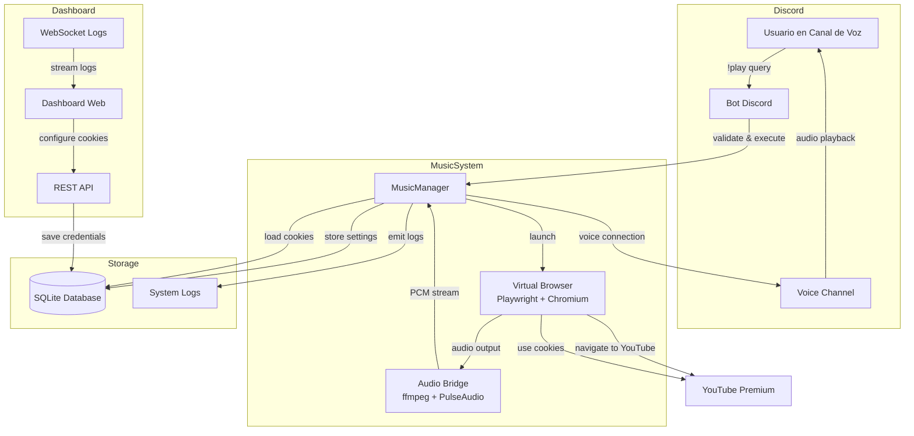
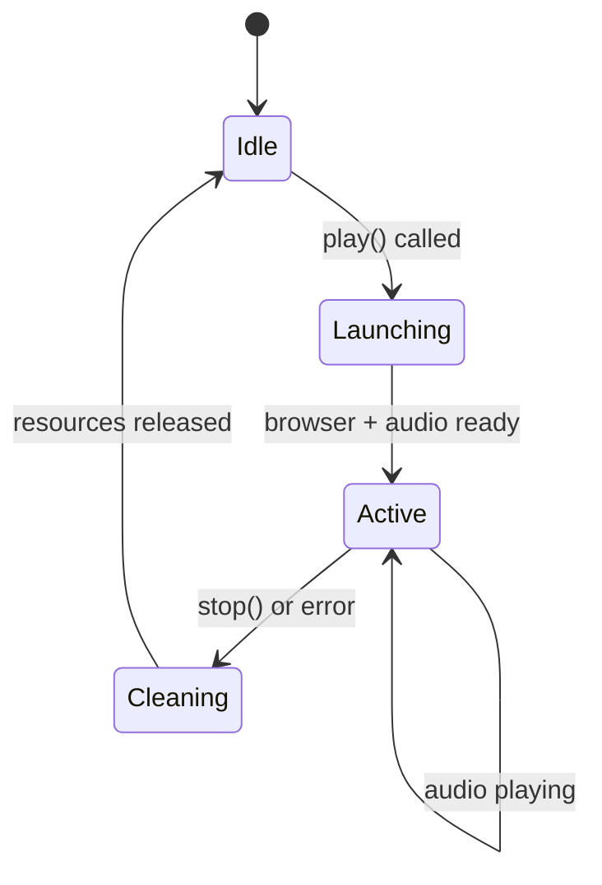
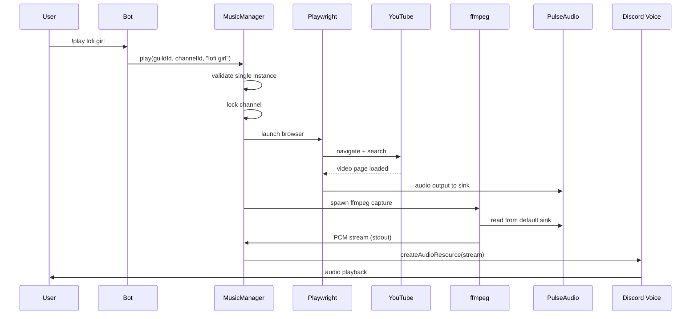

# Design Document: YouTube Premium Music System

## Overview

El sistema de música con YouTube Premium es una extensión del bot de Discord HackLab que permite a cualquier usuario reproducir música de alta calidad sin anuncios mediante comandos de Discord. El sistema utiliza un navegador virtual (Playwright + Chromium) para acceder a YouTube Premium, captura el audio mediante ffmpeg y PulseAudio, y lo transmite a canales de voz de Discord.

### Key Design Principles

1. **Single Instance Architecture**: Solo una sesión de música puede estar activa a la vez para evitar conflictos de recursos
2. **Channel Locking**: El canal de voz que inicia la reproducción tiene control exclusivo hasta que termine la sesión
3. **Separation of Concerns**: Los comandos de reproducción son exclusivos de Discord (!play, !stop), mientras que el dashboard solo sirve para configuración de credenciales y monitoreo
4. **Resource Management**: Limpieza automática y completa de recursos (navegador, ffmpeg, conexiones) en caso de errores o finalización
5. **Security First**: Validación estricta de inputs, sanitización de queries, y almacenamiento seguro de credenciales

### Architecture Diagram



## Architecture

### High-Level Architecture

El sistema se compone de cuatro capas principales:

1. **Command Layer (Discord Interface)**
   - Maneja comandos de Discord (!play, !stop)
   - Valida permisos y estado del usuario (canal de voz)
   - Proporciona feedback inmediato al usuario

2. **Music Management Layer**
   - Clase `MusicManager` que coordina todo el flujo de reproducción
   - Gestiona el estado de la sesión única (single instance)
   - Implementa el bloqueo de canal (channel lock)
   - Coordina el ciclo de vida del navegador virtual y audio bridge

3. **Audio Pipeline Layer**
   - Virtual Browser: Playwright + Chromium para acceder a YouTube
   - Audio Bridge: ffmpeg + PulseAudio para capturar y convertir audio
   - Discord Voice: @discordjs/voice para transmitir a Discord

4. **Configuration & Monitoring Layer**
   - Dashboard web para configurar credenciales de YouTube Premium
   - API REST para gestión de configuración
   - WebSocket para streaming de logs en tiempo real
   - Base de datos SQLite para persistencia

### Low-Level Architecture

#### MusicManager Class

```javascript
class MusicManager {
    constructor(client) {
        this.client = client;              // Discord client
        this.browser = null;               // Playwright browser instance
        this.page = null;                  // Browser page
        this.connection = null;            // Discord voice connection
        this.player = createAudioPlayer(); // Discord audio player
        this.currentTrack = null;          // Current track title
        this.channelName = null;           // Locked voice channel name
        this.channelId = null;             // Locked voice channel ID
        this.isActive = false;             // Session active flag
        this.ffmpegProcess = null;         // ffmpeg process handle
        this.guildId = null;               // Current guild ID
    }
}
```

**State Machine:**



#### Audio Pipeline Flow



## Components and Interfaces

### 1. MusicManager Component

**Responsibilities:**
- Gestionar el estado de sesión única
- Coordinar el ciclo de vida del navegador virtual
- Manejar el audio bridge con ffmpeg
- Gestionar conexiones de voz de Discord
- Implementar limpieza de recursos

**Public Methods:**

```javascript
async play(guildId, voiceChannelId, query)
// Inicia reproducción de música
// Throws: Error si ya hay sesión activa o query inválida
// Returns: void

async stop()
// Detiene reproducción y limpia recursos
// Returns: void

getStatus()
// Obtiene estado actual de la sesión
// Returns: { active: boolean, currentTrack: string|null, channel: string|null, channelId: string|null }
```

**Internal Methods:**

```javascript
async _launchBrowser(guildId)
// Lanza navegador con cookies de YouTube Premium
// Returns: Browser instance

async _navigateToYouTube(query)
// Navega a YouTube y busca/reproduce video
// Returns: video title

_startAudioBridge()
// Inicia ffmpeg para capturar audio
// Returns: ChildProcess

async _cleanup()
// Limpia todos los recursos
// Returns: void
```

### 2. Audio Bridge Component

**Technology Stack:**
- ffmpeg: Captura y conversión de audio
- PulseAudio: Sistema de audio virtual en Linux
- @discordjs/voice: Transmisión a Discord

**Configuration:**

```javascript
const ffmpegArgs = [
    '-f', 'pulse',              // Input format: PulseAudio
    '-i', 'default',            // Input source: default sink
    '-ac', '2',                 // Audio channels: stereo
    '-ar', '48000',             // Sample rate: 48kHz (Discord standard)
    '-f', 's16le',              // Output format: signed 16-bit little-endian PCM
    'pipe:1'                    // Output to stdout
];
```

**Audio Resource Creation:**

```javascript
const resource = createAudioResource(ffmpegProcess.stdout, {
    inputType: StreamType.Raw,
    inlineVolume: true
});
```

### 3. Virtual Browser Component

**Playwright Configuration:**

```javascript
const browserOptions = {
    headless: true,
    args: [
        '--autoplay-policy=no-user-gesture-required',
        '--no-sandbox',
        '--disable-setuid-sandbox',
        '--use-fake-ui-for-media-stream',
        '--disable-features=AudioServiceSandbox'
    ]
};
```

**Cookie Management:**

```javascript
// Load cookies from database
const settings = await db.getMusicSettings(guildId);
if (settings && settings.yt_cookies) {
    const cookies = JSON.parse(settings.yt_cookies);
    await context.addCookies(cookies);
}
```

**Navigation Flow:**

1. Si query es URL de YouTube → navegar directamente
2. Si query es texto → construir URL de búsqueda
3. Esperar a que cargue el selector de video
4. Si es búsqueda → click en primer resultado
5. Esperar elemento `<video>`
6. Extraer título de la página

### 4. Database Schema

**Existing Table (already in db.js):**

```sql
CREATE TABLE IF NOT EXISTS music_settings (
    guild_id TEXT PRIMARY KEY,
    yt_cookies TEXT,
    volume INTEGER DEFAULT 100,
    last_channel_id TEXT
);
```

**New Table for Logs:**

```sql
CREATE TABLE IF NOT EXISTS music_logs (
    id INTEGER PRIMARY KEY AUTOINCREMENT,
    guild_id TEXT,
    timestamp DATETIME DEFAULT CURRENT_TIMESTAMP,
    level TEXT,  -- 'info', 'warning', 'error', 'debug'
    message TEXT,
    stack_trace TEXT,
    metadata TEXT  -- JSON string for additional context
);
```

**Database Functions:**

```javascript
// Existing (already in db.js)
async function getMusicSettings(guildId)
async function updateMusicSettings(guildId, settings)

// New functions to add
async function logMusicEvent(guildId, level, message, stackTrace, metadata)
async function getMusicLogs(guildId, filters)
async function clearOldLogs(daysToKeep)
```

### 5. API Endpoints

**GET /api/music/status**
- Auth: Required
- Returns: Current session status
```json
{
    "active": true,
    "currentTrack": "Lofi Girl - beats to relax/study to",
    "channel": "Sala de Voz 1",
    "channelId": "123456789",
    "guildId": "987654321",
    "uptime": 3600,
    "memoryUsage": 150.5
}
```

**POST /api/music/session**
- Auth: Required
- Body: `{ "cookies": "[{...}]" }`
- Validates JSON format
- Stores encrypted in database
- Returns: `{ "success": true }`

**GET /api/music/logs**
- Auth: Required
- Query params: `?level=error&limit=100&search=ffmpeg`
- Returns: Array of log entries
```json
[
    {
        "id": 1,
        "timestamp": "2024-01-15T10:30:00Z",
        "level": "error",
        "message": "FFmpeg process crashed",
        "stackTrace": "...",
        "metadata": "{\"channelId\":\"123\"}"
    }
]
```

**GET /api/music/errors**
- Auth: Required
- Returns: Recent errors with stack traces
```json
[
    {
        "timestamp": "2024-01-15T10:30:00Z",
        "error": "Browser launch failed",
        "stack": "Error: ...",
        "context": { "guildId": "123" }
    }
]
```

**WebSocket /ws/music/logs**
- Auth: Required
- Real-time log streaming
- Emits events: `{ "type": "log", "data": {...} }`

### 6. Input Validation Component

**Query Validation:**

```javascript
function validateMusicQuery(query) {
    // Check null/undefined
    if (!query || typeof query !== 'string') {
        throw new Error("Query inválida");
    }
    
    // Trim whitespace
    const trimmed = query.trim();
    
    // Check length
    if (trimmed.length === 0 || trimmed.length > 500) {
        throw new Error("Query debe tener entre 1 y 500 caracteres");
    }
    
    // Check for malicious protocols
    if (trimmed.includes('javascript:') || trimmed.includes('data:')) {
        throw new Error("Query contiene contenido no permitido");
    }
    
    return trimmed;
}
```

**Cookie Validation:**

```javascript
function validateYouTubeCookies(cookiesString) {
    try {
        const cookies = JSON.parse(cookiesString);
        
        if (!Array.isArray(cookies)) {
            throw new Error("Cookies debe ser un array");
        }
        
        // Validate cookie structure
        for (const cookie of cookies) {
            if (!cookie.name || !cookie.value || !cookie.domain) {
                throw new Error("Estructura de cookie inválida");
            }
        }
        
        return cookies;
    } catch (e) {
        throw new Error(`JSON inválido: ${e.message}`);
    }
}
```

## Data Models

### MusicSession Model

```javascript
{
    guildId: string,           // Discord guild ID
    channelId: string,         // Locked voice channel ID
    channelName: string,       // Locked voice channel name
    currentTrack: string,      // Current track title
    isActive: boolean,         // Session active flag
    startedAt: Date,           // Session start timestamp
    browser: Browser,          // Playwright browser instance
    page: Page,                // Browser page
    connection: VoiceConnection, // Discord voice connection
    player: AudioPlayer,       // Discord audio player
    ffmpegProcess: ChildProcess  // ffmpeg process
}
```

### MusicSettings Model

```javascript
{
    guild_id: string,          // Discord guild ID (primary key)
    yt_cookies: string,        // JSON string of YouTube cookies (encrypted)
    volume: number,            // Volume level (0-100)
    last_channel_id: string    // Last used voice channel ID
}
```

### MusicLog Model

```javascript
{
    id: number,                // Auto-increment ID
    guild_id: string,          // Discord guild ID
    timestamp: Date,           // Log timestamp
    level: string,             // 'info' | 'warning' | 'error' | 'debug'
    message: string,           // Log message
    stack_trace: string,       // Stack trace (for errors)
    metadata: string           // JSON string with additional context
}
```

### SystemStatus Model

```javascript
{
    active: boolean,           // Is session active
    currentTrack: string|null, // Current track title
    channel: string|null,      // Locked channel name
    channelId: string|null,    // Locked channel ID
    guildId: string|null,      // Current guild ID
    uptime: number,            // Session uptime in seconds
    memoryUsage: number,       // Memory usage in MB
    browserStatus: string,     // 'active' | 'inactive' | 'error'
    ffmpegStatus: string       // 'active' | 'inactive' | 'error'
}
```

## Correctness Properties

*A property is a characteristic or behavior that should hold true across all valid executions of a system—essentially, a formal statement about what the system should do. Properties serve as the bridge between human-readable specifications and machine-verifiable correctness guarantees.*

### Property 1: Single Instance Invariant

*For any* sequence of play() commands, the Music_System should never have more than one active session at any given time.

**Validates: Requirements 1.1, 1.2**

### Property 2: Session Cleanup Completeness

*For any* Music_Session that ends (via stop() or error), all resources (browser, ffmpeg, connection) should be null and isActive should be false.

**Validates: Requirements 1.3, 8.2, 8.3, 8.4, 8.5, 8.6**

### Property 3: Channel Lock Persistence

*For any* Music_Session started in Voice_Channel A, the channelId should remain A until the session ends.

**Validates: Requirements 2.1, 2.4**

### Property 4: Channel Lock Enforcement

*For any* active Music_Session in Voice_Channel A, play() commands from Voice_Channel B (where B ≠ A) should be rejected with an error.

**Validates: Requirements 2.2**

### Property 5: Database Persistence Round-Trip

*For any* valid settings object (cookies, volume, channel), storing it via updateMusicSettings() then retrieving via getMusicSettings() should return an equivalent object.

**Validates: Requirements 2.5, 3.4, 10.1, 10.2, 10.3**

### Property 6: JSON Cookie Validation

*For any* string input to cookie validation, if it is valid JSON array of cookie objects it should be accepted, otherwise it should be rejected with a descriptive error.

**Validates: Requirements 3.2**

### Property 7: Query Length Validation

*For any* Music_Query string, if its length is greater than 500 characters, it should be rejected with an error.

**Validates: Requirements 5.3**

### Property 8: YouTube URL Construction

*For any* Music_Query that does not contain "youtube.com" or "youtu.be", the system should construct a YouTube search URL with the query properly encoded.

**Validates: Requirements 5.4**

### Property 9: Track Title Extraction

*For any* successful play() operation, the currentTrack property should contain a non-empty string representing the video title.

**Validates: Requirements 5.6**

### Property 10: Voice Channel Requirement

*For any* user not in a Voice_Channel, executing !play should be rejected with an error message.

**Validates: Requirements 5.1.2**

### Property 11: Stop Command Channel Validation

*For any* user in Voice_Channel B attempting to execute !stop while the active session is in Voice_Channel A (where B ≠ A), the command should be rejected.

**Validates: Requirements 5.1.6**

### Property 12: API Status Response Structure

*For any* state of the Music_System, GET /api/music/status should return a JSON object containing fields: active, currentTrack, channel, channelId, guildId.

**Validates: Requirements 9.1**

### Property 13: API Authentication Enforcement

*For any* music API endpoint request without valid authentication, the system should return HTTP 401 status code.

**Validates: Requirements 9.6**

### Property 14: API Error Response Format

*For any* API request that results in an error, the response should be valid JSON with an "error" field containing a descriptive message.

**Validates: Requirements 9.7**

### Property 15: Input Sanitization

*For any* Music_Query containing malicious protocols ("javascript:", "data:"), the system should reject it before processing.

**Validates: Requirements 9.8, 5.2**

### Property 16: Error Cleanup Guarantee

*For any* error that occurs during play(), the stop() method should be called to ensure complete resource cleanup.

**Validates: Requirements 8.1**

## Error Handling

### Error Categories

1. **Validation Errors**
   - Invalid query format
   - Query too long
   - Malicious protocols detected
   - Invalid JSON cookies
   - User not in voice channel

2. **Resource Errors**
   - Browser launch failure
   - ffmpeg spawn failure
   - Voice connection failure
   - Database connection failure

3. **Session Errors**
   - Session already active
   - Channel lock violation
   - Browser crash during playback
   - ffmpeg process crash

4. **External Service Errors**
   - YouTube navigation timeout
   - Video not found
   - Network connectivity issues

### Error Handling Strategy

**Validation Errors:**
```javascript
try {
    const validQuery = validateMusicQuery(query);
} catch (err) {
    // Return user-friendly error message
    return message.reply(`❌ Error: ${err.message}`);
}
```

**Resource Errors:**
```javascript
try {
    this.browser = await chromium.launch(browserOptions);
} catch (err) {
    console.error('[Music] Browser launch failed:', err);
    await this.stop(); // Cleanup partial resources
    throw new Error('No se pudo iniciar el navegador virtual');
}
```

**Session Errors:**
```javascript
if (this.isActive) {
    throw new Error(`Ya hay una reproducción activa en el canal: ${this.channelName}`);
}
```

**Cleanup on Error:**
```javascript
async play(guildId, voiceChannelId, query) {
    try {
        // ... playback logic
    } catch (err) {
        console.error('[Music] Error during playback:', err);
        await this.stop(); // Always cleanup on error
        throw err; // Re-throw for caller to handle
    }
}
```

### Logging Strategy

**Log Levels:**
- `debug`: Detailed flow information (browser navigation, ffmpeg params)
- `info`: Normal operations (session started, track playing)
- `warning`: Recoverable issues (retry attempts, fallback behavior)
- `error`: Failures requiring attention (crashes, validation failures)

**Log Format:**
```javascript
function logMusicEvent(level, message, metadata = {}) {
    const logEntry = {
        timestamp: new Date().toISOString(),
        level,
        message,
        ...metadata
    };
    
    console.log(`[Music:${level.toUpperCase()}]`, message, metadata);
    
    // Store in database for dashboard
    db.logMusicEvent(
        metadata.guildId,
        level,
        message,
        metadata.stack,
        JSON.stringify(metadata)
    );
    
    // Emit to WebSocket for real-time monitoring
    wsServer.emit('music:log', logEntry);
}
```

**Critical Error Notifications:**
```javascript
if (level === 'error') {
    // Emit special event for dashboard error panel
    wsServer.emit('music:error', {
        timestamp: new Date().toISOString(),
        error: message,
        stack: metadata.stack,
        context: metadata
    });
}
```

## Testing Strategy

### Dual Testing Approach

El sistema utilizará tanto unit tests como property-based tests para garantizar correctness completa:

- **Unit tests**: Verifican ejemplos específicos, casos edge, y condiciones de error
- **Property tests**: Verifican propiedades universales a través de múltiples inputs generados aleatoriamente

Ambos tipos de tests son complementarios y necesarios para cobertura comprehensiva.

### Property-Based Testing

**Framework:** fast-check (JavaScript property-based testing library)

**Configuration:**
- Mínimo 100 iteraciones por property test
- Cada test debe referenciar su propiedad del diseño mediante comentario
- Tag format: `// Feature: youtube-premium-music-system, Property {number}: {property_text}`

**Example Property Test:**

```javascript
const fc = require('fast-check');

describe('Music System Properties', () => {
    test('Property 1: Single Instance Invariant', () => {
        // Feature: youtube-premium-music-system, Property 1: Single Instance Invariant
        fc.assert(
            fc.property(
                fc.array(fc.record({
                    guildId: fc.string(),
                    channelId: fc.string(),
                    query: fc.string()
                })),
                async (commands) => {
                    const manager = new MusicManager(mockClient);
                    let activeSessions = 0;
                    
                    for (const cmd of commands) {
                        try {
                            await manager.play(cmd.guildId, cmd.channelId, cmd.query);
                            activeSessions++;
                        } catch (err) {
                            // Expected if session already active
                        }
                        
                        // Invariant: never more than 1 active session
                        expect(activeSessions).toBeLessThanOrEqual(1);
                        
                        if (manager.isActive) {
                            await manager.stop();
                            activeSessions = 0;
                        }
                    }
                }
            ),
            { numRuns: 100 }
        );
    });
});
```

### Unit Testing

**Framework:** Jest

**Test Categories:**

1. **Validation Tests**
```javascript
describe('Query Validation', () => {
    test('should reject queries longer than 500 characters', () => {
        const longQuery = 'a'.repeat(501);
        expect(() => validateMusicQuery(longQuery)).toThrow('Query debe tener entre 1 y 500 caracteres');
    });
    
    test('should reject javascript: protocol', () => {
        expect(() => validateMusicQuery('javascript:alert(1)')).toThrow('Query contiene contenido no permitido');
    });
});
```

2. **Session Management Tests**
```javascript
describe('MusicManager Session', () => {
    test('should reject play when session is active', async () => {
        const manager = new MusicManager(mockClient);
        manager.isActive = true;
        
        await expect(manager.play('guild1', 'channel1', 'test'))
            .rejects.toThrow('Ya hay una reproducción activa');
    });
    
    test('should cleanup all resources on stop', async () => {
        const manager = new MusicManager(mockClient);
        manager.browser = mockBrowser;
        manager.ffmpegProcess = mockProcess;
        manager.connection = mockConnection;
        manager.isActive = true;
        
        await manager.stop();
        
        expect(manager.browser).toBeNull();
        expect(manager.ffmpegProcess).toBeNull();
        expect(manager.connection).toBeNull();
        expect(manager.isActive).toBe(false);
    });
});
```

3. **API Endpoint Tests**
```javascript
describe('Music API Endpoints', () => {
    test('GET /api/music/status returns correct structure', async () => {
        const response = await request(app)
            .get('/api/music/status')
            .set('Cookie', authCookie);
        
        expect(response.status).toBe(200);
        expect(response.body).toHaveProperty('active');
        expect(response.body).toHaveProperty('currentTrack');
        expect(response.body).toHaveProperty('channel');
    });
    
    test('POST /api/music/session requires authentication', async () => {
        const response = await request(app)
            .post('/api/music/session')
            .send({ cookies: '[]' });
        
        expect(response.status).toBe(401);
    });
});
```

4. **Integration Tests**
```javascript
describe('Audio Pipeline Integration', () => {
    test('should launch browser with correct configuration', async () => {
        const manager = new MusicManager(mockClient);
        await manager._launchBrowser('guild1');
        
        expect(chromium.launch).toHaveBeenCalledWith(
            expect.objectContaining({
                headless: true,
                args: expect.arrayContaining([
                    '--autoplay-policy=no-user-gesture-required'
                ])
            })
        );
    });
    
    test('should spawn ffmpeg with correct parameters', () => {
        const manager = new MusicManager(mockClient);
        manager._startAudioBridge();
        
        expect(spawn).toHaveBeenCalledWith(
            ffmpeg,
            expect.arrayContaining(['-f', 'pulse', '-i', 'default'])
        );
    });
});
```

### Test Coverage Goals

- **Unit Test Coverage**: Mínimo 80% de cobertura de líneas
- **Property Test Coverage**: Todas las propiedades de correctness deben tener al menos un property test
- **Integration Test Coverage**: Todos los flujos críticos (play, stop, error cleanup) deben tener tests de integración

### Mocking Strategy

**External Dependencies to Mock:**
- `chromium.launch()` → Mock browser instance
- `spawn(ffmpeg)` → Mock child process
- `joinVoiceChannel()` → Mock voice connection
- `db.getMusicSettings()` → Mock database calls
- Discord client and guild objects

**Mock Example:**
```javascript
const mockBrowser = {
    newContext: jest.fn().mockResolvedValue({
        addCookies: jest.fn(),
        newPage: jest.fn().mockResolvedValue(mockPage)
    }),
    close: jest.fn()
};

jest.mock('playwright', () => ({
    chromium: {
        launch: jest.fn().mockResolvedValue(mockBrowser)
    }
}));
```

### Continuous Integration

**Pre-commit Hooks:**
- Run unit tests
- Run linter (ESLint)
- Check code formatting (Prettier)

**CI Pipeline:**
1. Run all unit tests
2. Run all property tests
3. Generate coverage report
4. Fail if coverage < 80%
5. Run security audit (npm audit)

