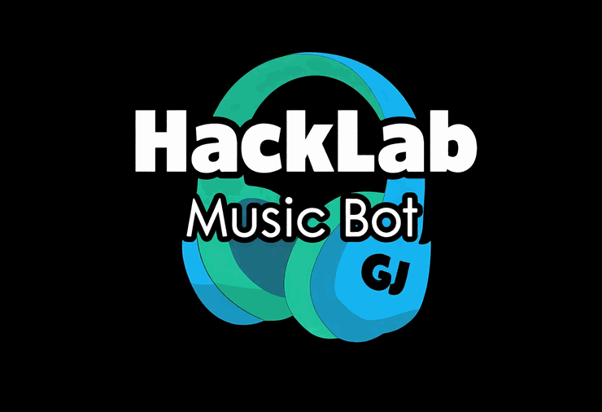

# HackLabH Bot — Portal Público

  
  <h3>Un bot de música y comunidad para Discord, con enfoque en transparencia, seguridad y cumplimiento.</h3>

## ¿Qué encontrarás aquí?
Este repositorio es la **cara pública oficial** de HackLabH Bot.

Aquí publicamos únicamente:
- Releases y novedades oficiales
- Guías para usuarios
- Comandos disponibles
- Auditorías y seguridad
- Estado público del servicio
- Noticias e integraciones visibles

## Lo que NO publicamos
Para proteger la seguridad del ecosistema:
- Core privado del bot
- Secretos, credenciales o infraestructura sensible
- Detalles técnicos internos que puedan comprometer seguridad

## Enlaces rápidos
- ?? **Invitar el bot**: https://panel.hacklabh.xyz/invite
- ??? **Comandos**: [COMMANDS.md](./COMMANDS.md)
- ?? **Novedades**: [UPDATES.md](./UPDATES.md)
- ?? **Estado público**: [STATUS.md](./STATUS.md)
- ?? **Seguridad**: [SECURITY.md](./SECURITY.md)
- ?? **Licencia**: [LICENSE](./LICENSE)

## Compromiso público
HackLabH Bot mantiene un compromiso activo de:
- Operación legal y responsable
- Visibilidad pública de cambios relevantes
- Comunicación clara de mejoras y controles
- Mejora continua en calidad, seguridad y experiencia

---

¿Quieres usar HackLabH Bot en tu servidor?
?? **Invítalo aquí:** https://panel.hacklabh.xyz/invite